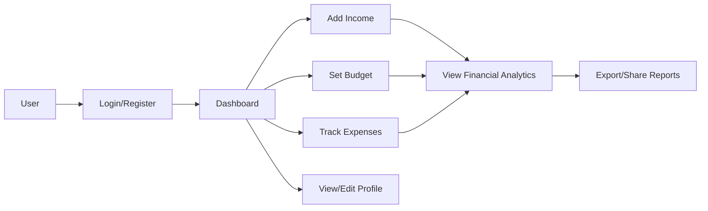

# 💰 Expense Tracker

<div align="center">
  
  
  
</div>

<p align="center">
  
</p>

> A comprehensive expense tracking and budgeting application built with modern web technologies. Take control of your finances, track expenses, manage budgets, and visualize your spending habits.

## ✨ Features

- 🔐 **Secure Authentication** - User registration and login system
- 💸 **Expense Tracking** - Record and categorize your expenses
- 💰 **Budget Management** - Set and track spending limits by category
- 💵 **Income Management** - Log your income and see your cash flow
- 📊 **Financial Analytics** - Visualize spending patterns with interactive charts
- 📱 **Responsive Design** - Works on desktop, tablet, and mobile devices
- 🌙 **Dark Mode** - Easy on the eyes, day or night
- 🔔 **Budget Alerts** - Get notified when expenses exceed budgets

## 🔄 Application Flow



## 🛠️ Technologies

<div align="center">
  
  
  
  
  
  
  
  
  
</div>

### Frontend

- 🎨 HTML5 & CSS3 for structure and styling
- 📱 Responsive design with CSS Grid and Flexbox
- 📊 Chart.js for data visualization
- 🔍 Font Awesome for icons
- 🌓 Custom light/dark theme implementation

### Backend

- ⚙️ Node.js runtime environment
- 🛣️ Express.js web application framework
- 🗄️ MongoDB with Mongoose for data storage
- 🔑 JWT (JSON Web Tokens) for authentication
- 🔒 Bcrypt for password hashing

## 📸 Screenshots

<div align="center">
  <p><strong>Dashboard View</strong></p>
  
  <br/><br/>
  
  <p><strong>Expense Tracking</strong></p>
  
  <br/><br/>
  
  <p><strong>Budget Management</strong></p>
  
</div>

## 🚀 Setup Instructions

### Prerequisites

- Node.js (v14.x or higher)
- MongoDB (v4.x or higher)
- npm or yarn

### Installation

1. **Clone the repository**

   ```bash
   git clone https://github.com/yourusername/expense-tracker.git
   cd expense-tracker
   ```

2. **Install dependencies**

   ```bash
   npm install
   # or
   yarn install
   ```

3. **Configure environment variables**

   ```bash
   cp .env.example .env
   # Edit .env with your settings
   ```

4. **Start the development server**

   ```bash
   npm run dev
   # or
   yarn dev
   ```

5. **Access the application**
   - Open `http://localhost:3000` in your browser
   - Register or login to start tracking your expenses

## 📡 API Endpoints

### Authentication

| Method | Endpoint                 | Description       |
| ------ | ------------------------ | ----------------- |
| POST   | `/api/auth/login`        | User login        |
| POST   | `/api/auth/register`     | User registration |
| POST   | `/api/auth/verify-token` | Verify JWT token  |

### Budgets

| Method | Endpoint               | Description       |
| ------ | ---------------------- | ----------------- |
| GET    | `/api/budgets/:userId` | Get all budgets   |
| POST   | `/api/budgets`         | Create new budget |
| PUT    | `/api/budgets/:id`     | Update budget     |
| DELETE | `/api/budgets/:id`     | Delete budget     |

### Expenses

| Method | Endpoint                          | Description        |
| ------ | --------------------------------- | ------------------ |
| GET    | `/api/expenses/:userId`           | Get all expenses   |
| POST   | `/api/expenses`                   | Create new expense |
| PUT    | `/api/expenses/:id`               | Update expense     |
| DELETE | `/api/expenses/:id`               | Delete expense     |
| GET    | `/api/expenses/:userId/analytics` | Get analytics      |

### Income

| Method | Endpoint              | Description       |
| ------ | --------------------- | ----------------- |
| GET    | `/api/income/:userId` | Get user's income |
| PUT    | `/api/income/:userId` | Update income     |

## 🧪 Development

```bash
# Run tests
npm test

# Start development server with auto-reload
npm run dev

# Build for production
npm run build

# Start production server
npm start
```

## 🌟 Deployment Options

### Render.com (Full-Stack)

1. Sign up at [render.com](https://render.com)
2. Connect your GitHub repository
3. Create a new Web Service
4. Select "Node.js" as environment
5. Set start command: `node server.js`

### Vercel

1. Sign up at [vercel.com](https://vercel.com)
2. Install Vercel CLI: `npm i -g vercel`
3. Run `vercel` in project directory

### Netlify + Heroku/Render

1. Deploy frontend on [netlify.com](https://netlify.com)
2. Deploy backend separately on [heroku.com](https://heroku.com) or Render

## 👥 Contributing

We welcome contributions to make Expense Tracker even better!

1. Fork the repository
2. Create your feature branch: `git checkout -b feature/amazing-feature`
3. Commit your changes: `git commit -m 'Add some amazing feature'`
4. Push to the branch: `git push origin feature/amazing-feature`
5. Open a Pull Request

## 📝 License

This project is licensed under the ISC License - see the [LICENSE](LICENSE) file for details.

---

<div align="center">
  <sub>Built with ❤️ by  ShelbyG2</sub>
</div>
